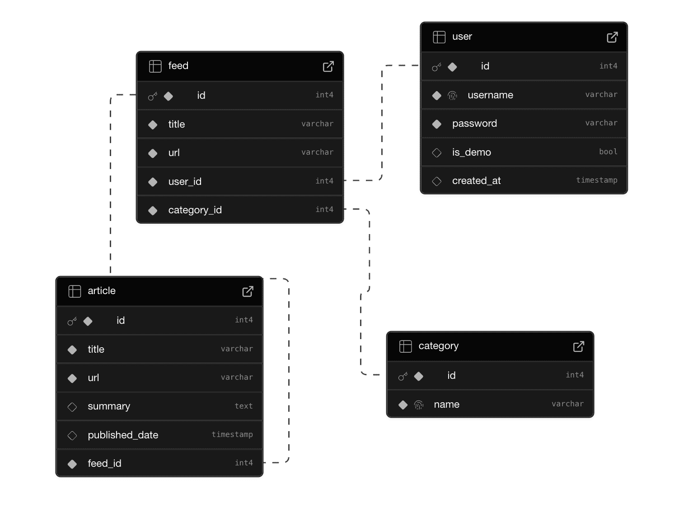
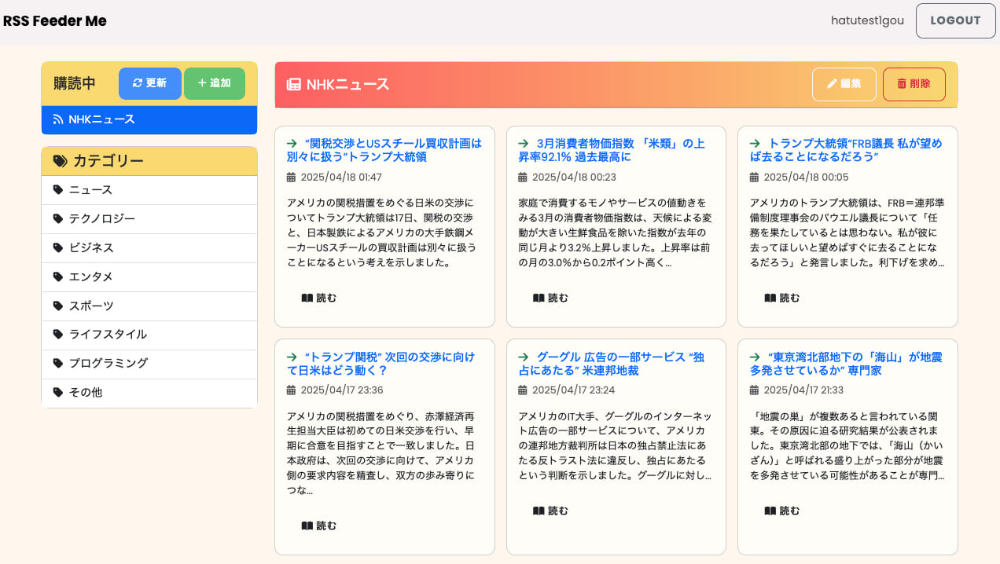

# RSS FeedMe – カスタムニュースフィードアプリ

## プロジェクト概要

ポートフォリオ用プロジェクト第4弾。
好きなサイトの最新ニュースを効率的にチェックできる RSSフィードリーダーです。  
カテゴリー管理や手動更新などの機能を備え、日々の情報収集をもっと快適に。

## 開発背景・目的

IT業界の進化は凄まじく、最新情報を追うだけでも一苦労。  
日本語・英語問わず多くのサイトを毎回巡回するのは大変です。

また、RSSという便利な仕組みも広告の多さや有料化などサービスの衰退で使いにくくなってきています。

**「IT業界のニュースを追うため自分の見たいサイトだけを登録して、効率よく情報収集出来たら便利そう！」**  
そんな思いと職業訓練でpython講座で学んだことから、このRSSリーダーを開発しました。

## ターゲットユーザー

- 技術ニュースや業界の最新情報を効率よく追いたい人  
- 複数サイトの巡回に疲れた人  
- 広告なしで、自分だけのニュースフィードが欲しい人

## 主な機能

- お気に入りのRSSサイトを登録し、最新フィードを取得
- カテゴリーごとに管理でき、必要な情報だけを抽出可能
- 手動更新ボタン・編集機能付き
- 自由にサイトを登録できる（選択式ではなくURL入力）
- ユーザー登録制で、個別管理を実現
- ユーザー、フィード登録数に上限あり
- フィードは15件以上は保存せず古い記事は削除

※現在Vercel Freeプランを使用しているため、複数のRSSフィードを登録している状態で同時に更新すると処理がタイムアウトする可能性があります。（Demoユーザー等）  
フィード更新を試す際はユーザー登録して1サイトのみで実行することを推奨します。

## 使用技術スタック

### フロントエンド

- Python（Flask）
- HTML
- Bootstrap CSS

### バックエンド・データベース

- Flask（Webフレームワーク）
- 開発時：SQLite（ローカル開発用に使用）
- 本番：Supabase（PostgreSQLベースのBaaS）

### デプロイ

- Vercel
rss-reader-olive.vercel.app

## 要件定義

- ユーザー認証（ユーザー名・パスワード）
- RSS取得・表示
- カテゴリー別登録
- フィード編集・削除
- Supabaseとのデータ連携

## 開発における挑戦

初めてのPython学習で実践的に学ぶためAIを活用して開発しました。
特にこれまでJavaScriptやJavaとも異なる構文の癖やインデントエラー、モジュールの概念等に苦戦しました。  
また、最初からFlaskを導入したことで設計や環境構築が複雑化しており理解まで手間取りました。

それでもエラーに向き合い、試行錯誤を重ねた結果、約85%の納得度で安定動作＆デプロイに成功。
次回以降はAI活用無しでPython開発を予定しています。

デザイン面でも、従来のRSSリーダーよりポップで明るいスタイルに仕上げました🎨

## 今後の改善ポイント

- レスポンシブデザイン未対応（スマホ表示時に崩れる可能性あり）
- 現状は画像のないフィード前提。画像入りだとレイアウトが崩れる可能性あり
- `feed_handler.py` のフィード取得日付処理に課題あり

## 📸 スクリーンショット

本アプリは個人利用を想定しており、登録するRSSフィードの内容・利用については各サイトの利用規約に従ってください。（ポートフォリオ用のため予告なしで停止や削除する場合があります）
一部サイトでは無断でのフィード取得や転載を禁止している場合がありますので、ご注意ください。
